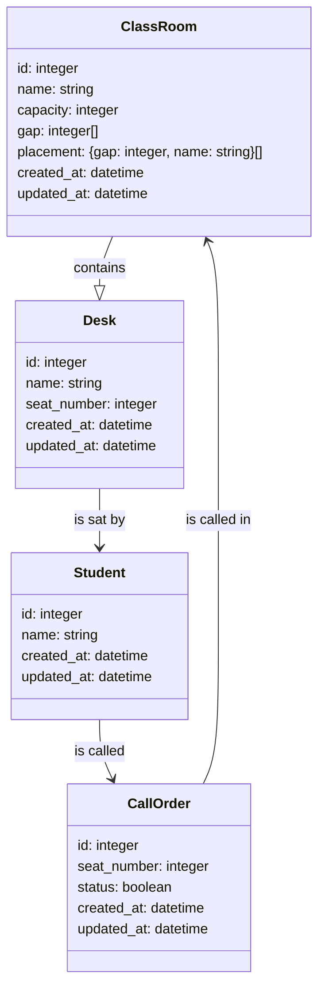

# 要件定義

## 概要

SchoolCall は、授業での呼び出し順を管理するアプリケーションです。
このアプリケーションにより、学生は教員を呼び出し登録することができ、
教員は学生の呼び出し順を確認することができます。
これにより、授業の進行がスムーズになり、授業の効率化が図れます。

## 目的

本アプリケーションの目的は、授業の進行をスムーズにし、授業の効率化を図ることです。
学生が自分の呼び出し順を確認できることで、授業の待ち時間を減らし、
教員が授業に集中できるようにサポートします。

# 要件仕様書

## 機能要件

- 学生登録機能：アプリに学生を登録することができます。学生は登録することで、自分の呼び出し順を確認することができます。
- 呼び出し登録機能：学生はアプリを使って自分を呼び出すことができます。呼び出しはアプリに反映されます。
- 呼び出し順表示機能：学生は自分の呼び出し順をアプリで確認できます。アプリは学生の呼び出し順を管理します。
- 呼び出し完了機能：教員は学生を呼び出した後、アプリ上で呼び出し完了とすることができます。呼び出し完了とすることで、学生の呼び出し順が更新されます。

## 使用技術
- Next.js
- TypeScript
- Tailwind CSS
- Prisma
- SQLite

# データ設計

## students テーブル

| カラム名   | 説明         | 型        | Unique | Nullable |
| ---------- | ------------ | --------- | ------ | -------- |
| id         | ID           | integer   | ✓      |          |
| name       | 名称         | string    |        |          |
| capacity   | 収容人数     | integer   |        |          |
| gap        | 窓の位置     | integer[] |        | ✓        |
| placement  | 生徒席の配置 | object[]  |        | ✓        |
| created_at | 作成日時     | datetime  |        |          |
| updated_at | 更新日時     | datetime  |        |          |

## classrooms テーブル

| カラム名   | 説明     | 型       | Unique | Nullable |
| ---------- | -------- | -------- | ------ | -------- |
| id         | ID       | integer  | ✓      |          |
| name       | 名称     | string   |        |          |
| created_at | 作成日時 | datetime |        |          |
| updated_at | 更新日時 | datetime |        |          |

## desks テーブル

| カラム名     | 説明       | 型       | Unique | Nullable |
| ------------ | ---------- | -------- | ------ | -------- |
| id           | ID         | integer  | ✓      |          |
| name         | 名称       | string   |        |          |
| seat_number  | 座席番号   | integer  |        |          |
| status       | ステータス | boolean  |        |          |
| student_id   | 学生 ID    | integer  |        | ✓        |
| classroom_id | 教室 ID    | integer  |        |          |
| created_at   | 作成日時   | datetime |        |          |
| updated_at   | 更新日時   | datetime |        |          |

## call_orders テーブル

| カラム名     | 説明     | 型       | Unique | Nullable |
| ------------ | -------- | -------- | ------ | -------- |
| id           | ID       | integer  | ✓      |          |
| name         | 名称     | string   |        |          |
| seat_number  | 座席番号 | integer  |        |          |
| student_id   | 学生 ID  | integer  |        | ✓        |
| classroom_id | 教室 ID  | integer  |        |          |
| created_at   | 作成日時 | datetime |        |          |
| updated_at   | 更新日時 | datetime |        |          |
